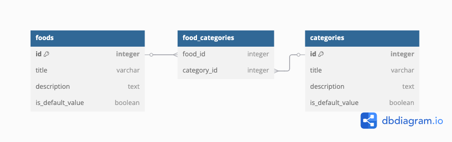

<h1 align="center">Foods of Taiwan</h1>
<h3 align="center">Learn about the various delicacies unique to Taiwan <a href='https://foods-of-taiwan.onrender.com/foods' target="”_blank”">here</a>!</h3>

    

### Description

Foods of Taiwan manages user generated data on food titles, descriptions, and categories.
 
Users can create, edit, delete, their own food items for everyone to see!
 
A selection of default foods and categories are also provided (which cannot be edited).

### Features

-   Create, Edit, Update, Delete foods and categories
-   Each food can have multiple categories
-   Mobile view and tablet / desktop view
-   A really cool animated dropdown menu!
-   My love and effort and stuff!

### Stack

-   PostgreSQL
-   NodeJS, Express
-   HTML, EJS, CSS
-   DB Hosting: neon.tech
-   Server Hosting: Render.com

## App Showcase

|  Foods Page |  Category Page  | 
|  ---------  |  -------------  | 
|  |  |

|  Edit Food  |  Delete Food  |
|  ---------  |  -----------  | 
|  |  |

## Learning Outcomes

-   First polished Express project
-   Database schema and queries to support each food item having multiple categories
    -   Thank you ARRAY_AGG and STRING_AGG
-   Creating database population scripts
-   Form validation and data sanitization / validation
-   Relearning how to animate in JS
-   File structure and organization
-   EJS javascript practice (I want to go back to react now please)

 

    

### Retrospective (aka yapping)

I was worried about how to query for multiple categories but my goat ARRAY_AGG rescued me. SQL is quite fun actually. Takes me back to uni haha. This project took me longer than usual. It was difficult at first to get used to separating logic into it's proper file (controller goes to controller, router logic goes to router, etc). I am very happy I stuck with it though because having the logic separated made debugging and aestetics much nicer because I know where everything is! EJS is also pretty neat but a bit cumbersome. I want react back.

## Acknowledgements

| Usage   |     Source     |
| ------- | -------------- |
| Icons   | icons8.com     |
| Specs   | [The Odin Project](https://www.theodinproject.com/lessons/node-path-nodejs-inventory-application) |
